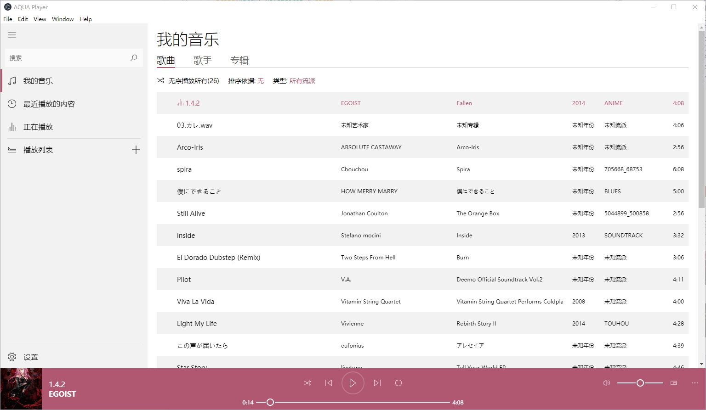
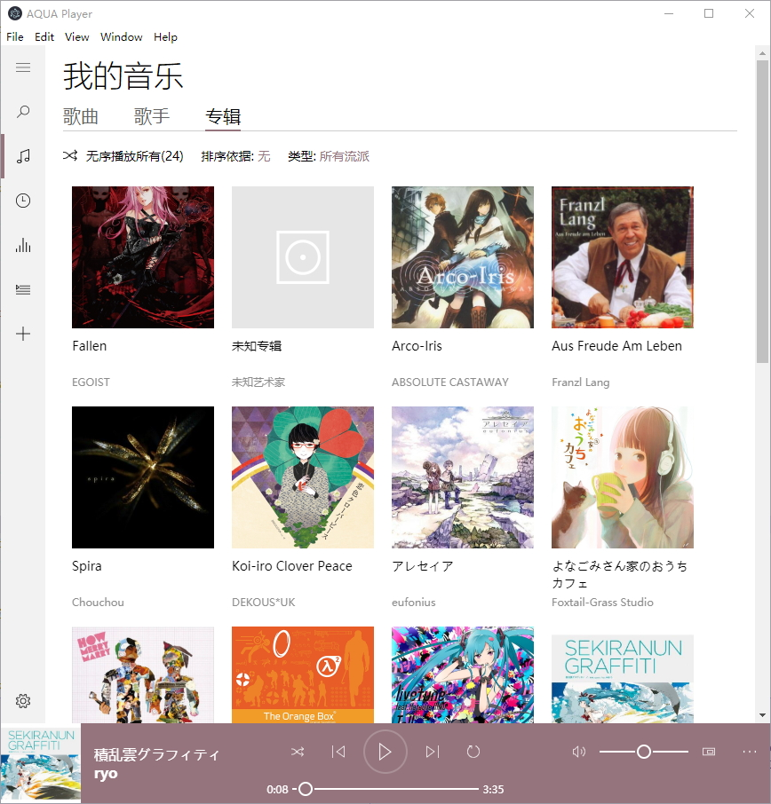

# 写一个仿 groove 的音乐播放器

记录一下遇到的坑

- ES6模块不可用, 必须require
- index.html的js, require, src等路径都需要设为相对路径, 是相对与该html文件的位置
- AudioBufferSourceNode只能start()一次, 要再次播放需要重新createBufferSource并设置buffer, 并connect, 然后start该src
- AudioContext的currentTime is a read-only property
- AudioContext建立以后 currentTime 是一直增长的, currentTime应该视为一条增长的时间轴的当前长度
- AudioBufferSourceNode.start([when][, offset][, duration])的三个参数这么理解:
  - when 为该音乐素材加入时间轴的位置
  - offset 为在该时间轴上播放开始的位置
  - duration 就是播放的时长
- input[type="range"] 的拖动小按钮时改变其样式, 直觉的选择器是:

  *input[type="range"]::-webkit-slider-thumb:active*

  但这会有问题, 在单击轨道其他点(跳到某处)时按钮样式没有改变, 应该这么写选择器:
  
  *input[type="range"]:active::-webkit-slider-thumb*
- AudioBufferSourceNode 的 buffer 只能 set 一次, 否则会报错. 需要销毁或替换掉, 重新创建该节点
- indexDB使用方式:
  - 首先需要创建一个 IDBOpenDBRequest , 通过 indexedDB.open(name, version) 创建
  - 在 IDBOpenDBRequest 上绑定事件, onsuccess, onerror, onupgradeneeded 为常用的几个事件函数
  - 当 indexedDB.open(name, version) 的 version 比当前数值大时会触发 onupgradeneeded 事件函数调用, 之后会触发 onsuccess 事件函数调用. 第一次 indexedDB.open(name, version) 时会因为没有该数据库导致触发一次 onupgradeneeded. 至于为什么 version 从 1 开始可能是因为没有该数据库时内部实现默认为 0.
  - 依照上述行为, 当想要创建多个 IDBObjectStore 时, 逻辑是: 先在 onupgradeneeded 中多次调用 DBOpenRequest.result.createObjectStore 来创建. 完成后, 在 onsuccess 可以获得创建了的 IDBObjectStore. 踩坑: 如果在外部获取 IDBObjectStore 则会因为 createObjectStore 事务正在进行而报错, 一定要依据事件来获得正确的顺序
  - IDBDatabase.createObjectStore 和 IDBDatabase.deleteObjectStore 都是同步的方法, 必须在 onupgradeneeded 内.
  - 当有版本变动需求时, 必须在 onupgradeneeded 事件函数内添加

        db.onversionchange = () => {
        DBOpenRequest.result.close()
        }
    以关闭当前版本, 可选则添加 DBOpenRequest.onblocked 事件函数, 以观测 block 事件

TODO

- [x] 解决声音播放的问题
- [x] 寻找一个合适的audio文件metadata分析库
- [x] 调试electron主进程和渲染进程
- [x] 学习audio api实现播放器功能
  - [x] 起始状态各按钮点击情况
  - [x] 播放暂停功能
  - [x] 时间轨控制播放
  - [x] 音量调节
  - [x] 列表选歌播放
  - [x] 切换歌曲
  - [x] 按钮加入防抖, 加载动作设置了锁, 防止多次加载
  - [x] 记忆上一次关闭时的播放歌曲
- [x] data-view双向绑定
  - [x] proxy实现单向数据同步, 数据变动引起绑定的所有对象key的value更新
  - [x] view通过事件通知改变对应数据
  - [x] 数组渲染
    - [x] 数组方法劫持
    - [x] 视图同步
- [x] 状态管理, 事件驱动, 管理所有的数据变动
- [x] 列表渲染实现
- [x] 路由功能
  - [x] 切换显示(通过 css "display" 切换)
  - [x] 自定义元素选择性挂载
- [ ] 写完所有groove的组件
  - [x] 底部播放控制
  - [x] 左侧栏
  - [x] 歌曲列表
    - [x] 重名歌曲播放问题
  - [x] 歌手列表
  - [x] 排序功能实现
  - [x] 排序结果缓存
  - [x] 各个列表的分类排序
  - [x] 专辑列表
  - [x] 封面显示
  - [ ] 设置
    - [x] 已收藏文件夹功能
    - [x] 已收藏文件夹列表增删
    - [x] 已收藏文件夹歌曲列表更新(检查文件夹内音乐新增, 删除)
- [x] 主题色切换
- [ ] 每次都加载整个文件后才播放, 占内存, 耗时. 使用ffmpeg产生分块数据以即时播放(流式传输)
- [ ] 全部整合成最终的app

BUG修复

- [x] 严重的内存泄漏, 每次切换歌时都大幅增加内存占用
  - 原因: 泄露是因为 getSongSrc 闭包中创建的 AudioBufferSourceNode, 导致每次切歌增加内存占用
- [x] 全局事件总线 ebus 不断增加 listeners
  - 每次挂载组件后都新增一个, 忘了在组件卸载时删除相应的事件listener
- [x] store.js 的 changeSource 未完成, 导致 settings 增删文件夹面板视图没有同步
- [x] 相同文件夹重复载入, 视图有多个相同的文件夹
- [x] 在播放时, 操作文件夹增删, 再次点歌播放会报错
  - 修复方法: 当前音乐未播放完毕时, 不加载新的歌曲源, 通过currentSongFinished控制
- [x] 第一次启动时, songsPaths不存在, 但又触发了upgradeneeded, 导致报错
  - 修复方法: 判断songsPaths是否存在, 以选择是否执行后续逻辑
- [x] 第一次启动后, 第一次添加文件夹报错
  - 修复方法: shared.keyItemBuf是变化的, 不能赋值为一个常量
- [x] 数组同步视图, cast 方法添加监听器有内存泄露问题
  - 修复方法: 组件移除时清除监听器, 添加了removeCasted方法
- [ ] meta-data模块只能读取utf8编码的信息, 其他编码会导致乱码
- [ ] meta-data模块可能存在读取年份错误的问题, 也有可能是元数据本身有错误
- [x] pinyin模块排序会把所有字符转为小写, 而genre=R&B包含大写字母, 所以统一把genre转为大写字母

预览

