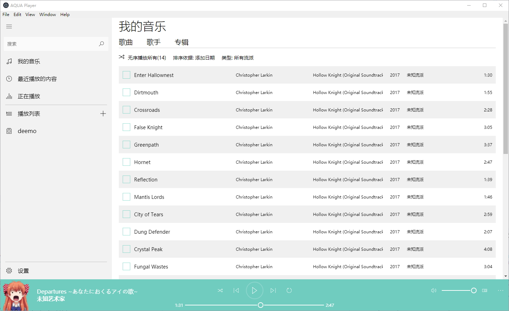

# 写一个仿 groove 的音乐播放器

记录一下遇到的坑

- ES6模块不可用, 必须require
- index.html的js, require, src等路径都需要设为相对路径, 是相对与该html文件的位置
- AudioBufferSourceNode只能start()一次, 要再次播放需要重新createBufferSource并设置buffer, 并connect, 然后start该src
- AudioContext的currentTime is a read-only property
- AudioContext建立以后 currentTime 是一直增长的, currentTime应该视为一条增长的时间轴的当前长度
- AudioBufferSourceNode.start([when][, offset][, duration])的三个参数这么理解:
  - when 为该音乐素材加入时间轴的位置
  - offset 为在该时间轴上播放开始的位置
  - duration 就是播放的时长
- input[type="range"] 的拖动小按钮时改变其样式, 直觉的选择器是:

  *input[type="range"]::-webkit-slider-thumb:active*

  但这会有问题, 在单击轨道其他点(跳到某处)时按钮样式没有改变, 应该这么写选择器:
  
  *input[type="range"]:active::-webkit-slider-thumb*
- AudioBufferSourceNode 的 buffer 只能 set 一次, 否则会报错. 需要销毁或替换掉, 重新创建该节点

TODO

- [x] 解决声音播放的问题
- [x] 寻找一个合适的audio文件metadata分析库
- [x] 调试electron主进程和渲染进程
- [ ] 学习audio api实现播放器功能
  - [ ] 起始状态各按钮点击情况(未考虑)
  - [x] 播放暂停功能
  - [x] 时间轨控制播放
  - [x] 音量调节
  - [x] 列表选歌播放
  - [x] 切换歌曲
- [x] data-view双向绑定
  - [x] proxy实现单向数据同步, 数据变动引起绑定的所有对象key的value更新
  - [x] view通过事件通知改变对应数据
  - [x] 数组监听
- [ ] 状态管理, 事件驱动, 管理所有的数据变动
- [x] 列表渲染实现
- [ ] 写完所有groove的组件
  - [x] 底部播放控制
  - [x] 左侧栏
  - [x] 歌曲列表
  - [x] 歌手列表
  - [x] 排序功能实现
  - [x] 专辑列表
  - [ ] 设置
  - [ ] 各个列表的分类排序
- [ ] 每次都加载整个文件后才播放, 占内存, 耗时. 使用ffmpeg产生分块数据以即时播放(流式传输)
- [x] 严重的内存泄漏, 每次切换歌时都大幅增加内存占用
  - 解决: 泄露是因为 getSongSrc 闭包中创建的 AudioBufferSourceNode, 导致每次切歌增加内存占用
- [ ] 全部整合成最终的app

预览

